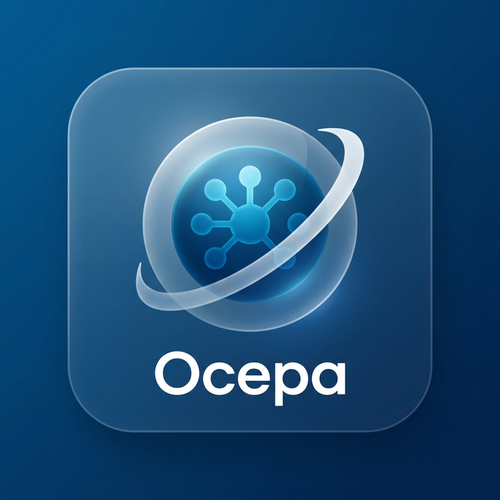

# Ocepa: AI-Powered Lecture Companion 🎓

Ocepa is an advanced, real-time study companion designed to support students with learning difficulties and enhance academic retention. Using **Gemini 2.0 Flash**, it provides live transcription and structured note-taking to help you focus on the materials that matter.



## 🚀 Features

-   **Secure Authentication**: Personal student accounts with strict data isolation.
-   **Live Perspective**: Streams high-fidelity audio to Gemini for real-time transcription.
-   **Structured Notes**: Automatically categorizes insights into *Key Points*, *Definitions*, and *Formulas*.
-   **Focus Mode**: Interaction is disabled during live sessions to minimize distraction.
-   **Post-Lecture Review**: Revisit transcriptions, view concise summaries, and chat with an AI tutor about the specific content.
-   **Permanent Resource**: Every lecture becomes a searchable, private study asset.

## 🛠️ Technology Stack

-   **Frontend**: React (Vite), TypeScript, Tailwind CSS
-   **Backend/Database**: Supabase
-   **AI Engine**: Gemini 2.0 Flash Multimodal Live API
-   **Animations**: Framer Motion

## 📦 Setup & Installation

### 1. Prerequisites
-   Node.js (v18+)
-   Supabase Account
-   Google AI Studio API Key (Gemini)

### 2. Database Schema
Run the following SQL in your Supabase SQL Editor:

```sql
create table lectures (
  id uuid default gen_random_uuid() primary key,
  user_id uuid references auth.users(id) on delete cascade not null,
  title text not null,
  transcript jsonb default '[]'::jsonb,
  notes jsonb default '[]'::jsonb,
  summary text,
  created_at timestamp with time zone default timezone('utc'::text, now()) not null
);

-- Enable RLS
alter table lectures enable row level security;

-- Policies
create policy "Users can manage their own lectures" 
on lectures for all 
using (auth.uid() = user_id);
```

### 3. Environment Configuration
Create a `.env` file in the root directory:

```env
VITE_SUPABASE_URL=YOUR_SUPABASE_URL
VITE_SUPABASE_ANON_KEY=YOUR_SUPABASE_ANON_KEY
VITE_GEMINI_API_KEY=YOUR_GEMINI_API_KEY
```

### 4. Run Locally
```bash
npm install
npm run dev
```

## 🚢 Deployment
Building the production-ready bundle:
```bash
npm run build
```
The application is ready to be hosted on platforms like Vercel, Netlify, or GitHub Pages.

---
*Empowering every student through intelligent connectivity.*
